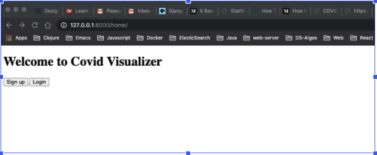
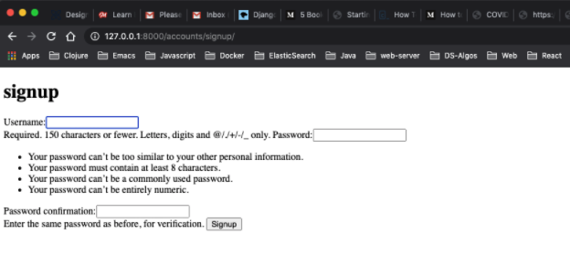
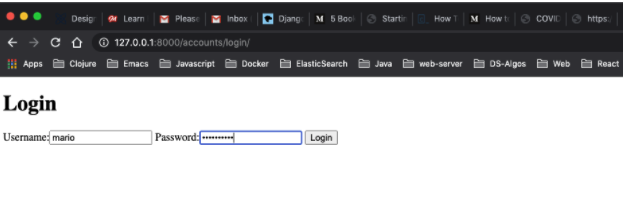
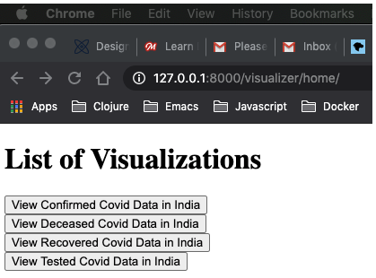
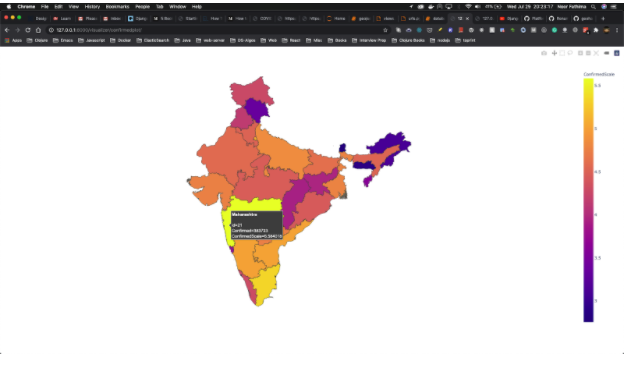
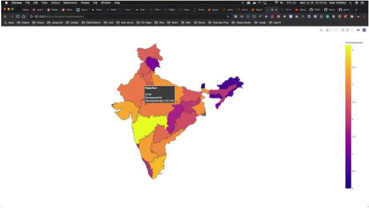
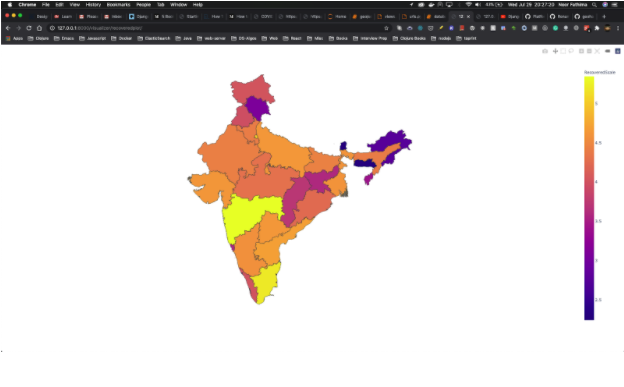
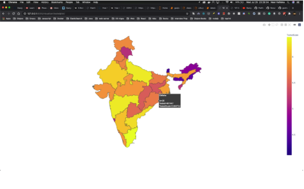
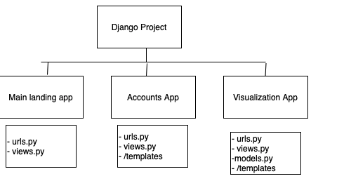
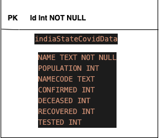

# COVID Data Visualizer
Noor Afshan Fathima

# CONTENTS:
- Description of Project 3
- Technologies Used 3
- Instructions to start the application 3
- Snapshots 
	- User Interface of the web application 4
		- Snapshot1: Landing page (Extra Credit: GUI and Menu system) 4
		- Snapshot2: Signup Form 4
		- Snapshot3: Login Form 5
		- Snapshot4: Homepage 5 
	- Snapshots of Data Visualizations 6
		- Snapshot5 : Visualization of Confirmed Covid Cases in India 6
- Snapshot6 : Visualization of  Deceased due to Covid  in India 7 
- Snapshot7 : Visualization of Recovered people from Covid Cases in India 8
- Snapshot8 : Visualization of number of people tested for Covid in India 9
- Extra Credit 10
- Django 10
- Sqlite 11
- Plotting maps using geo-json data 11
- Using logarithmic scale for proper distribution of data through  color in map 12
- Sample Code in jupyter notebook 

# Description of Project:
- This project uses APIs from https://api.covid19india.org/ to get data about COVID-19 situation in India for each of its 32 states. The geo-json data of India map drawn with its state boundaries is obtained from https://github.com/geohacker/india. The COVID-19 data is mapped accordingly to each of Indian state and a choropleth map of India is visualized using geo-json data. The first map is the number of confirmed covid cases in each state, similarly the proceeding maps depict number of deceased due to covid, number of recovered cases and number of people tested, in each of the states. 

## Choropleth Map: 
- A choropleth map is a type of thematic map in which areas are shaded or patterned in proportion to a statistical variable that represents an aggregate summary of a geographic characteristic within each area, such as population density or per-capita income.

## Technologies used: 
- Python, Miniconda
- Django web framework
- SQLite3
- Libraries: Plotly, Pandas, Numpy, 

### To start the application: 
-First install all the technologies and libraries listed above
- Get in the noor_FinalProject/src directory and run command
`python manage.py runserver`
- When the app spins up in the browser after the ip address append /home to reach the landing page. Use the browser back button to navigate back if necessary. 
- I also have a jupyter notebook with some sample code. Please run the geojson.py.ipynb file and then run database.py.ipynb in the notebook. The visualization will open up in firefox browser. 

# Snapshots:  

## User Interface of the web application

#### Snapshot1: Landing page



#### Snapshot2: Signup Form



#### Snapshot3: Login Form



#### Snapshot4: Homepage



## Snapshots of Data Visualization:

#### Snapshot5: Visualization of Confirmed Covid Cases in India 



#### Snapshot6: Visualization of Deceased due to Covid in India



#### Snapshot7: Visualization of recovered people from Covid in India



#### Snapshot8: Visualization of number of people tested for Covid in India



## Django Web Framework:
- This project is in the form of a web application built using Django web framework.
- The structure of the web app is as shown below: 



## Urls: 
- /home : landing page
- /accounts/signup : signup page
- /accoutns/login : login page
- /visualization/home : homepage
- /visualizer/confirmedplot : visualization of confirmed cases
- /visualizer/deceasedplot : visualization of deceased data
- /visualizer/recoveredplot: visualization of recovered people data
- /visualizaer/testedplot: visualization of number of people tested

## SQLite3:
- This project reads the data from the API and then cleans it to store it in the DB. The DB structure is as follows, It has only one table:



# Plotting Maps using geo-json data:
- Geojson data: GeoJSON is a format for encoding a variety of geographic data structures. 

- This project uses the geo-json data of India to plot the map.

```
{"type": "Feature",
  "geometry": {
    "type": "Point",
    "coordinates": [125.6, 10.1]
  },
  "properties": {
    "name": "Dinagat Islands"
  }}
```

## Using logarithmic scale for proper distribution of data through color in map:
- This project does not use raw numbers to show the color distribution. Doing so would color it very brightly and unevenly. Hence I have used logarithmic scale for scaling the data.
Eg. `df['ConfirmedScale'] = np.log10(df['Confirmed'])`


